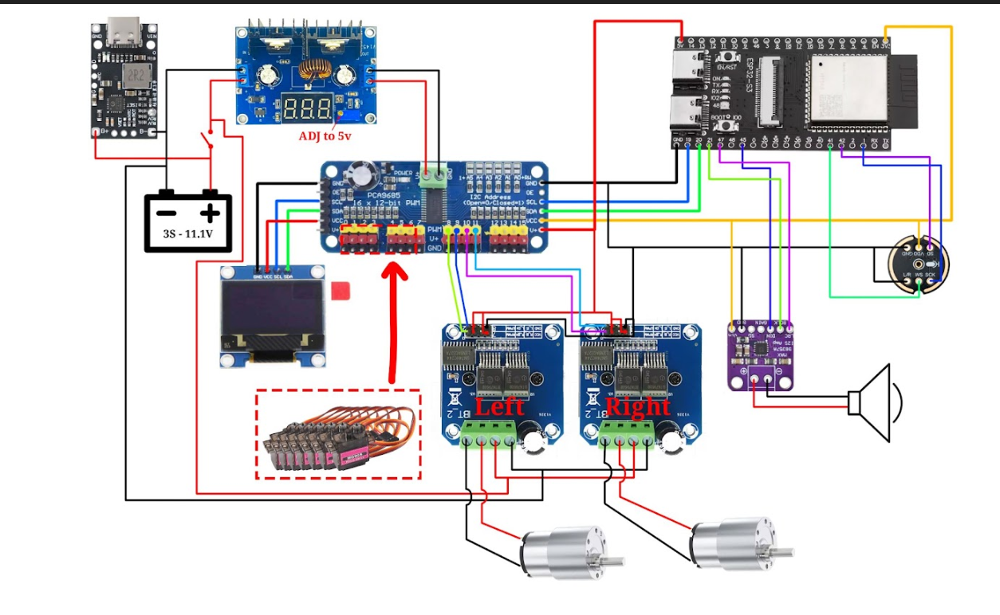
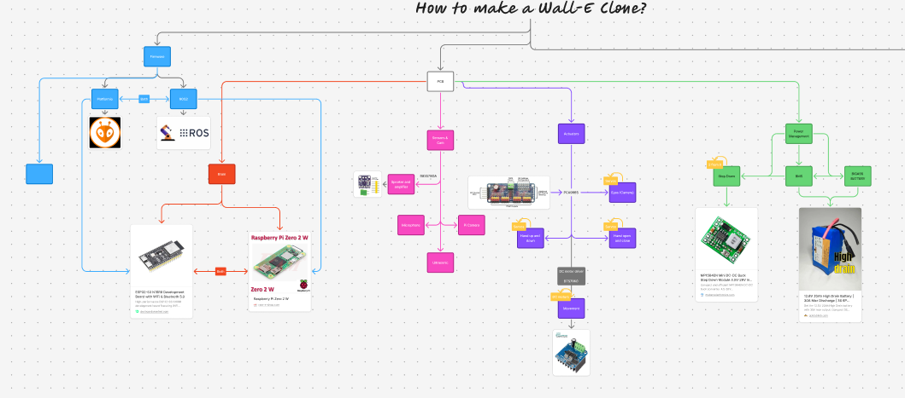

# WALL-E

> **Contributors:**
> - 
> - 

---

## Day 1 

- **Date:** 14/9/2026
- **Total hours spent:** 2.5 hours

### Entry:

AHM AHM, uhhhh, this is my first time to work with someone on the same projct wow. 

uhh, wellll, this is kinda cool tbh, we are learning how to use github together and how to use the branches and many other things.

Well, this journal will be color coded with the user name of the Entry's writter, so i hope it will be easy for you to review.

Anyways, let me quickly say what i did in these hours.

Well, I started a huddle with my friend Ziad and we worked together at the same time to think on how we will make this project, well we started searching for already made clones, and we found manyyyyy.

So he started searching on his part (which is 3D CAD), and i started searching about the circuit and the PCB.

Well, i started searching about the circuits and we found this [youtube vid](https://www.youtube.com/watch?v=r7WV-IAMnDo), and from it i found this [site](https://www.huyvector.org/robots-kinetic/full-3d-wall-e-ai).

And it had a really help full circuit and data,

but i won't just copy it, tbh we need to learn more in this journey, so we will use with that all, a PI zero w, and ROS2 to build it all in simulation. So i added it to our [figjam](https://www.figma.com/board/f0VK2TiKBMFvHDcY7YVH4b/WALL-E?node-id=0-1&p=f&t=FYDFyjY4fB7zOlku-0).

And we are still searching but that's it for these 2.5 hours.

### Recording links:
- https://lapse.hackclub.com/timelapse/BbDoTyLWUVCc
- https://lapse.hackclub.com/timelapse/BIIMvZWpS5dI

## Day 1 

- **Date:** 14/9/2026
- **Total hours spent:** 2 hours

### Entry:

First day working with Nader horray i guess, it feels weird discussing the same project with someone else. We brainstormed for a bit then decided to build WALL-E a fully autonomous robot i think we would work on it for the whole 8 weeks. Nader started a figma and sent it to me so i started preparing the mind map i guess.
I began looking for already made clones to get the idea and understand what are we gonna do i found this project on instructables [2008 Clone](https://www.instructables.com/Build-an-autonomous-Wall-E-Robot/) it didnt offer much actually most of the electronics used were outdated and the functions of the robot itself isnt that good. 

Actually the design of it is quite good however i found another clone that is way better and way wayyyy more complex. [The main clone](https://www.youtube.com/watch?v=r7WV-IAMnDo)
This version is way better regarding the 3d model it uses 7 servos for arm, neck, and eyes.
Altough i think there will be some changes in the design i want to make however this is a very good start.

### Recording links:
- https://lapse.hackclub.com/timelapse/B3YAmoDpvFuT
- https://lapse.hackclub.com/timelapse/6B3niGL5X6WF

------------------------------

## Day 2 

- **Date:** 15/9/2026
- **Total hours spent:** 2.3 hours

### Entry:

WO, umm the second day, Well i kept searching for the remaining things that we need to add in the circuit and the firmware.

Searched for the things we will add without copying, like the ROS2, and the Isaac sim from Nvidia. 

the IMU sensor, and tid up the figjam.

um, for the Isaac sim, i was searching on how we will connect all of that in a simulation 'cause we don't know how to use ROS2 without buliding IRL, So i got many options but choosed Isaac sim 'cause it is from Nvidia and i have an Nvidia graphics card so it will be helpful. 

Also found something called Omnigraph nodes, it is something like gamemaker's nocode programing system, it uses nodes like it. and we can make custom omnigraph nodes to make them communicate with the ESP for examble. 

After finding out about the simulation and the ROS2, i also started searching more about the sensor, and what are we missing.

Found that we can use an IMU, and also 2 ultrasonic, one from the back and one from the front.

and polished the figma a lil. 

And that's if for this figjam (my part), here you are the full figma.

And after that, i started my kicad project and started make some pages and adding some components to the ESP32-s3 page, but i stoped after that and will continue in the next session.

### Recording links:
- https://lapse.hackclub.com/timelapse/Nfs9XLhcbCvm

## Day 2 

- **Date:** 15/9/2026
- **Total hours spent:** 3.2 hours

### Entry:

I started this day with reviewing the last video and making a full mind map to using figma i started with the Eyes components and connection as shown in the image in which it the left eye would hold the camera with the pi zero 2w i thinkk .... i hadnt get quite sure about it yett actually. The right eye would hold the microphone and thats it, for the movement im using two servos for the movment of the right and left eye up and down it would move in cicuilar motion.

For the track and movement that where it gets tricky in which it uses alot of parts to form the whole motion not the simple one which is two gears and track connecting them this one forms the shape of a triangle in which there are three gears with a track around it the track itslef is formed from small parts conncted to each other with smaller connectores 

The neck uses two servos one for the y-axis and one for the x-axis which acts like a robotic arm and the body itself isnt that hard to be honest i just need to make sure that there is space for the pcb mounting and screen space on the front as well as an open and close compartment.

This is the whole [figma](https://www.figma.com/board/f0VK2TiKBMFvHDcY7YVH4b/WALL-E?node-id=0-1&p=f&t=AjgSqVmfp2gSIqVG-0)

### Recording links:
- https://lapse.hackclub.com/timelapse/i-zrSsbCG7CH
- https://lapse.hackclub.com/timelapse/cxqHd1hT7iQd

------------------------------

## Day 3 

- **Date:** 16/9/2026
- **Total hours spent:** 5.4 houra

### Entry:

TESTING Site with a real Commit

Checking if there are any conflicts when edtiingg old entry

### Recording links:
- [Finished another Amp & DC motor drivers · 2h 12m · Sep 16, 2026](https://lapse.hackclub.com/timelapse/Qo54ww1bt61t)
- [Finished ESP & 1 amplifier · 1h 58m · Sep 16, 2026](https://lapse.hackclub.com/timelapse/P7H9uDIHuwvh)
