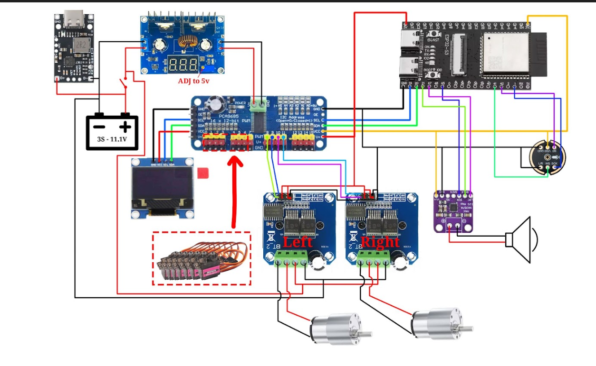
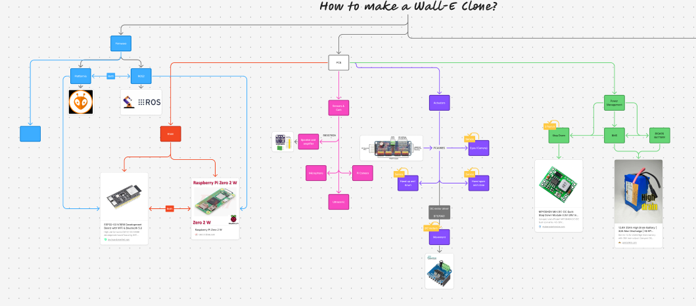

# WALL-E

> **Contributors:**
> - 
> - 

---

## Day 1 

- **Date:** 14/9/2026
- **Total hours spent:** 2.5 hours

### Entry:

AHM AHM, uhhhh, this is my first time to work with someone on the same projct wow. 

uhh, wellll, this is kinda cool tbh, we are learning how to use github together and how to use the branches and many other things.

Well, this journal will be color coded with the user name of the Entry's writter, so i hope it will be easy for you to review.

Anyways, let me quickly say what i did in these hours.

Well, I started a huddle with my friend Ziad and we worked together at the same time to think on how we will make this project, well we started searching for already made clones, and we found manyyyyy.

So he started searching on his part (which is 3D CAD), and i started searching about the circuit and the PCB.

Well, i started searching about the circuits and we found this [youtube vid](https://www.youtube.com/watch?v=r7WV-IAMnDo), and from it i found this [site](https://www.huyvector.org/robots-kinetic/full-3d-wall-e-ai).

And it had a really help full circuit and data,

but i won't just copy it, tbh we need to learn more in this journey, so we will use with that all, a PI zero w, and ROS2 to build it all in simulation. So i added it to our [figjam](https://www.figma.com/board/f0VK2TiKBMFvHDcY7YVH4b/WALL-E?node-id=0-1&p=f&t=FYDFyjY4fB7zOlku-0).

And we are still searching but that's it for these 2.5 hours.

### Recording links:
- https://lapse.hackclub.com/timelapse/BbDoTyLWUVCc
- https://lapse.hackclub.com/timelapse/BIIMvZWpS5dI

## Day 1 

- **Date:** 14/9/2026
- **Total hours spent:** 2 hours

### Entry:

First day working with Nader horray i guess, it feels weird discussing the same project with someone else. We brainstormed for a bit then decided to build WALL-E a fully autonomous robot i think we would work on it for the whole 8 weeks. Nader started a figma and sent it to me so i started preparing the mind map i guess.
I began looking for already made clones to get the idea and understand what are we gonna do i found this project on instructables [2008 Clone](https://www.instructables.com/Build-an-autonomous-Wall-E-Robot/) it didnt offer much actually most of the electronics used were outdated and the functions of the robot itself isnt that good. 

Actually the design of it is quite good however i found another clone that is way better and way wayyyy more complex. [The main clone](https://www.youtube.com/watch?v=r7WV-IAMnDo)
This version is way better regarding the 3d model it uses 7 servos for arm, neck, and eyes.
Altough i think there will be some changes in the design i want to make however this is a very good start.

### Recording links:
- https://lapse.hackclub.com/timelapse/B3YAmoDpvFuT
- https://lapse.hackclub.com/timelapse/6B3niGL5X6WF

------------------------------

## Day 2 

- **Date:** 15/9/2026
- **Total hours spent:** 2.3 hours

### Entry:

WO, umm the second day, Well i kept searching for the remaining things that we need to add in the circuit and the firmware.

Searched for the things we will add without copying, like the ROS2, and the Isaac sim from Nvidia. 

the IMU sensor, and tid up the figjam.

um, for the Isaac sim, i was searching on how we will connect all of that in a simulation 'cause we don't know how to use ROS2 without buliding IRL, So i got many options but choosed Isaac sim 'cause it is from Nvidia and i have an Nvidia graphics card so it will be helpful. 

Also found something called Omnigraph nodes, it is something like gamemaker's nocode programing system, it uses nodes like it. and we can make custom omnigraph nodes to make them communicate with the ESP for examble. 

After finding out about the simulation and the ROS2, i also started searching more about the sensor, and what are we missing.

Found that we can use an IMU, and also 2 ultrasonic, one from the back and one from the front.

and polished the figma a lil. 

And that's if for this figjam (my part), here you are the full figma.

And after that, i started my kicad project and started make some pages and adding some components to the ESP32-s3 page, but i stoped after that and will continue in the next session.

### Recording links:
- https://lapse.hackclub.com/timelapse/Nfs9XLhcbCvm

## Day 2 

- **Date:** 15/9/2026
- **Total hours spent:** 3.2 hours

### Entry:

I started this day with reviewing the last video and making a full mind map to using figma i started with the Eyes components and connection as shown in the image in which it the left eye would hold the camera with the pi zero 2w i thinkk .... i hadnt get quite sure about it yett actually. The right eye would hold the microphone and thats it, for the movement im using two servos for the movment of the right and left eye up and down it would move in cicuilar motion.

For the track and movement that where it gets tricky in which it uses alot of parts to form the whole motion not the simple one which is two gears and track connecting them this one forms the shape of a triangle in which there are three gears with a track around it the track itslef is formed from small parts conncted to each other with smaller connectores 

The neck uses two servos one for the y-axis and one for the x-axis which acts like a robotic arm and the body itself isnt that hard to be honest i just need to make sure that there is space for the pcb mounting and screen space on the front as well as an open and close compartment.

This is the whole [figma](https://www.figma.com/board/f0VK2TiKBMFvHDcY7YVH4b/WALL-E?node-id=0-1&p=f&t=AjgSqVmfp2gSIqVG-0)

### Recording links:
- https://lapse.hackclub.com/timelapse/i-zrSsbCG7CH
- https://lapse.hackclub.com/timelapse/cxqHd1hT7iQd

------------------------------

## Day 3 

- **Date:** 16/9/2026
- **Total hours spent:** 5.4 hours

### Entry:

UHHH, well i took the whole 5 hours today to finish this week quickly so i can SIP (Study in peace). 

Ummm, OKkk i started with the ESP32-s3 in the schemaitc, and tbh, i did this before, i was about to replicate it slowly but naah, i just copied it from my old project.

So after that, i started with the amplifier module, as i said before (ig) that i need to impliment all the modules in the PCB, like fully integirated and not just modules, So i started searching for the amplifer schematic everywhere, and found two option.

stereo and mono, but i prefered the stereo tbh, so i got the PCB and Schem from adafruit. and tried to reverse engineer it to catch all the components. 

And vola i got it done.

it wasn't easy tbh, as i needed to lookk into the three images of this amplifer (PCB, Schematic, and even the 3D & IRL component).

As there were many smd components that i don't know where they are like this 2 pads solder jumper.

After that I started a new recording 'cause we wanted to calculate how so far we reached.

I finished the second channel amplifer and this is the FULL ampliifer image.

After the amplifer, i started working on the DC motor driver, BRUUUUUUh i took so much time trying to figure out what iam facing.

I really didn't find any clear PCB design of it but i found a Schematic, and also the IRL component from the back and the front.

This component FR made me reverse engineeer hardware, i really took so much time trying to figre out how it works. 

But the surpirse was that i was thinking for this whole time that it is dual channel Motor driver, and found out that it is just one channel, and i was super overwhelmed. so basicly i just made its schematic too and duplicated it. so i got this final version.

 

After i finished this component i reached my 10 hours for this week, so YAYYAY iam gonna study finally for the rest of the week.

That's it, thx.

### Recording links:
- [Finished another Amp & DC motor drivers · 2h 12m · Sep 16, 2026](https://lapse.hackclub.com/timelapse/Qo54ww1bt61t)
- [Finished ESP & 1 amplifier · 1h 58m · Sep 16, 2026](https://lapse.hackclub.com/timelapse/P7H9uDIHuwvh)

## Day 3 

- **Date:** 16/9/2026
- **Total hours spent:** 1.25 hours

### Entry:

I finished the figma mindmap so decided to go for the next stage which is 3D modeling, i actually was thinking yeah it cant be that hard i quickly changes my mind after i decided to start modeling one of walle's eyes.(ONLY ONE !!) i was in a huddle with nader at least i wasnt alone when i was crying. I spend the whole hour figuring out the dimensions of the eye where the clone i was following isnt listed as open source so there were no way i can figure out the dimensions without estimating it.

  Howeverrrr, he listed the 3md file which gave me a clue about the scale there was no way i could have figured that on my own. So i opened onshape and began invistigating the 3d files and i got to a point where i was pretty sure about the dimensions of the eye. After sometime i skipped the eye design and got to one of body sides.

### Recording links:
- [3d model start · 1h 25m · Sep 16, 2026](https://lapse.hackclub.com/timelapse/R1QRREZ-F8Nh)

------------------------------

## Day 4 

- **Date:** 22/9/2026
- **Total hours spent:** 1.6

### Entry:

Uhh, ok in these 1.6 hours,
i Made a great work tbh in the schematic, ii worked on the servo controller and finished it all

So iam gonna talk here about how exactly i worked on it and where was the hard points. (i see that the servo controler was the hardest so that's why iam gonna talk more about it here.)

i searched for the servo controller on adafruit guides, and i found it there with its schematic and pcb and 3d model, just like the Amplifier. 

So, i started reading the schematic how it is made and tbh it wasn't that bad, not like the Amplifier, like i learned from the amplifer and got its hiddens and made it.

So i quickly got all the info and understood the schem, and then started making it in the actuators page in my kicad project.

Well, i found it in kicad default libraries and i added it, but when i added it, i saw that it was for PWMing LEDs, so i was kinda overwhelmed on how it should work with servos. 

But lol after i searched i got that it is normal that PWM can control LED brightness or Servos, i was kinda dump here but yay learned it. 

Anyways, i added a text on the symbol saying that it is controling Servos here not LEDs.

after that i searched about the rest of the components like capacitors and resistors and added them, but i saw a weird looking symbol that i didn' see before.

Well i got that it was a reverse voltage protection circuit, so i searched about the component and found its name on kicad "Q_PMOS_GDS"

after finishing its circuit, the last thing was the pins of the servos, so i started making one 12 pins and then copied it and pasted three more times, and i got this beauty. 

after finishing it, i added labels for the SDA and SCL and voala i finished the servo controller. 

TBH i was super afraid from this one specificly, i thought it is so big and has many things but it was easy (ahem ahem, in the Schematic not the PCB yet :skull)

### Recording links:
- [Made the Servos Controller · 1h 19m · Sep 22, 2026](https://lapse.hackclub.com/timelapse/AyFFHhh8GsSA)

## Day 4 

- **Date:** 17/9/2026
- **Total hours spent:** 0.4 hours

### Entry:

Yesterday i was stressing about the eye dimensions what so ever, i found that i can change the 3md file to stl so i can open it using solidworks, so i decided to open the file on solidworks and measure out the dimensions i needed so i can design my own walle eye.
I decided to use in connecting parts with each others M3 screws with a dimensions of 5 ml for the head 3 ml for the rest of the screw and a total length of 15ml this is supposed to be perfect i guesss we will seee. I also took a look at the 2008 walle where the design is impressive and i decided to add my touch in the eye. i just hope that all parts would be good to assemble. i finished the huddle with nader after this i think this is it for this week. 

I LOVE WALL-E

### Recording links:
- [left eye finish · 40m · Sep 17, 2026](https://lapse.hackclub.com/timelapse/tFEgx5JB15S5)

------------------------------

## Day 5 

- **Date:** 27/9/2026
- **Total hours spent:** 7

### Entry:

WOW, that was insane, ugh i don't know how i will journal all of these hours but duh, let's wrap it up.

Well, i continued working on the Schematic in this session, well, i nearly finished 95% of it.

I made MANYYY things, so i need to be kinda organized while writing ts, So iam gonna wrrite the big points downthere and than will take each point will talk about it.

1. I Started searching about the mic

    a. I got that i can use two

2. Searched about the camera
3. add hand sily made symbol for it with no pins.
4. searched about the 5v stepdown     
    b. gonna use two
5. got the resistors needed for 5v
6. edited the ESP32 pin labels, and made its page in the brain.
7. same for the RasPi
8. connected teh UART bridge between the Pi and the ESP.
9. Worked on the brain page pin distribution (it looks so awesome)
10. Made the same thing for the rest of the Pages
11. added a tft screen from my old project, to be like the dashboard or the screen under Wall-Es Eyes.
12. started connecting the screen to the raspi GPIO. 

WOW, these are so many points, anyways.

First, the camera. well this one was kinda super easy, but i just wondered how i will add it to the Schematic, so i just made a quick lil symbol for it with no connections, and then wrote on it that it is just a regular pi camera and also added the pi camera version.

Second, well for the stepdown, this one was super important, as it will be used to provide voltage for the pi and the esp, but i didn't want to connect the servos to the same stepdown, as it will take so much current and also can make the logic circuit disturbt. So, i added two stepdown with the same module, and connected a +5V to one of them and another +5AV to the other, as +5V is separated from +5AV. and +5AV is for the servos.

Third, i knew that this stepdown has a variable resistor to control the output voltage, but for me i didn't want to change anything, so i searched about the specific resistor value and placed a static resistor instead, in that way it won't never ever exceed 5.2V or lower than it.

Fourth, i edited the ESP pin labels to be hierachy labels, so i can access it from the outer page (Brain page), and also i organized the page pins based on the ESP32-s3 module itself as it looks so cool tbh. also made the same thing for the pi and connected the UART bridge for both of them so they can communicate wiredly. 

Fifth, The page of the brain in the main page, when i synced the labels i mean, i decided to make it as like as the QFP components, as it can represents the main proccessing unit and the brain of the system, So i added all the labels, and then started manageing and organizing them, i took two sides for the ESP32 GPIO and the other two for the RasPi GPIO. I made it superr cool tbh.

and yeah made the same thing for the rest of the pages and ordered the labels in a good way. and bruuuuuh, this looks soooo awesooomeee, this is my first time to use pages this intensvly, i used just one before.

Sixth, while i was checking the pages, i got that i forgot about one, the Dashboard, well actually i didn't even make brainstorm for it, so i just added a TFT 2.8 spi display, it will be like Wall-Es sun display and battery info, and also just a button to cut the main power.

after adding it, and syncing the dashboard page labels too, i searched about how i will connect it to the Pi or the ESP, and tbh ig connected to the Pi is better, as it can work on making the visuals instead of the weak esp. (dk ig so), So i connected it to the RasPi SPI pins, and also along with the touch. 

After that all, well bruuuh ig the mic and the speaker need some changes, as i searched and ig i can't connecct input and output I2S modules to the Pi at the same time. So i set this as a goal for the next session (or week). 

and yeah, that's it ig, i believe i got all the points in here. 
 
I hope i got this super well organized :cry.

### Recording links:
- [UGHH a lot and i don't rememeber · Sep 24, 2026](https://lapse.hackclub.com/timelapse/0kmRS9EgVi52)

## Day 5 

- **Date:** 26/9/2026
- **Total hours spent:** 3.43

### Entry:

This session i started with the second eye which i had to redo because mirroring it wouldnt work considring that so i needed to redo the eye by making more. i found when i finished the right eye that i forgot to add a hinge to connect the two eyes which will be connected with each other using a hinge conncetor.
I looked into it and saw the video again i found that i needed to make sure that the two of the holes are the same size to connect correctly however what i missed is that i needed to make the two parts which would hold the hinge in different places like for the right eye i would make it slightly forward and for the left eye i would make it slightly back so that when they are put next to each other they align perfectly and make it easier to use the hinge then after finishing the right and left eye i decided to go for the next part which is the inside of the eye. so what is the use of it ? 
it would be the place where they hold the mic sensor or module not decided yet, and the other eye would hold the camera we wanna use raspberry pi zero so i think a raspberry pi camera would be our choice i may need to ask nader later.
After finishing the inside part of the eye i decided to go for the rest of the eye to clarify:
walle's eye conisistes of small part and a big part that gives it the longtidunal shape which is very unique for walle the problem with the big part is that it needs to be designed to align perfectly with the small part and also offer space for adding sensors and wiring.
in this session i decided it was enough to stop here cause the big part woud take a lot of time so either i lock in now or just make it in the next session (lmao im writing this after i already finished the two sessions of the week) 
finally i prepared the files and made sketches for the rest of the parts 

### Recording links:
- https://lapse.hackclub.com/timelapse/RGJQpuucflLY

------------------------------

## Day 6 

- **Date:** 29/9/2026
- **Total hours spent:** 1.6 hours

### Entry:

In this session, i didn't to so much, i just continued on the previous work, and fully finished schematic, it was insane working on a schematic like that tbh. This was the biggest schem i've ever worked on till now. 

Well, i started with the mic & speakers problem with the raspi, i searched a lot, and found an artical stating that i can use the i2s bus in the raspi for both speakers and mic, but only one mic will be used, like i won't be able to use the stereo mode in the mic, so i just removed one of the mics and connected every thing.

And after that, i regularly started connecting all the parts to the brain, but considiring all the pins that i can't use in the esp and the pi, like the strapping pins and so on, and also seeing which pins can handle PWM as a default instead of using the ESPs GPIO internal matrix.

After some time, i connected all the parts to the brain, and also added tthe free GPIOs to a pin header for future upgrades.

### Recording links:
- [FInished the Schematic · 1h 27m · Sep 29, 2026](https://lapse.hackclub.com/timelapse/OweCQ4emUMqL)

## Day 6 

- **Date:** 27/9/2026
- **Total hours spent:** 4.41

### Entry:

Uhhhh this was the longest session till now i had started school this week so instead of organizing 

my things i decided to cramp up everthing last day i hate doing this i wish this is the last time ever

last time i was working on the eyes and i made a good progress regarding that however i didnt know 

that i needed to make two of the big part one for each eye i tought this would work by mirroring but 

i was WRONG i needed to redo it (yay more hours i guess) yeah i waasss too wrong i made the placment 

wrong it didnt FIT umm . i redid the eye it didnt take that much time however i struggled doing it 

for whatever reason so i began sketching again and again and then i fixed the mistake 

then i worked on the big part to make it fit i got it second try so i think  it was easy ?

nah there is still the hinge that connects the two eyes with each other it needs to be flexable so 

the eyes move. the design is toooo complex and i decided to not continuo because this was the 5th 

hour straight working. this is it for this weeek all love 

### Recording links:
- https://lapse.hackclub.com/timelapse/RGJQpuucflLY
- [3d eyes finish · 4h 41m · Sep 27, 2026](https://lapse.hackclub.com/timelapse/mJMa7ygXNcjQ)

------------------------------

## Day 7 

- **Date:** 4/10/2026
- **Total hours spent:** 1.8 hours

### Entry:

ummmm, welllll, a newwww stage of this massive project yayayay.

THE PCB :O

Well, of course the first thing any person in this world would do when he start the PCB layouting and tracing stage is assigning footprints

well, i have tons of footprints to assign, but fortunatly most of them are duplicates, so i will just copy and paste, also some of them are standard footprints like the SSOP8  and SO8 and so on.

So i started searched about each component i don't know its footprint, and just by quickly checking the package size code and dimensions, i found its footprint, but some components i didn't catch its package size name exactly, so by searching about its Model code, i downloaded its 3d and footprint from SnapEDA.

and for the Servos pin headers, i imported on of kicad's default footprints, and edited to match the real Servo controller module, and also to make it each to attach servos to it.

after that, i assiged all the components, and for the Resistors and capacitors, i used the size 0603 for all of them, as it is super small and efficant.

And after finishing all the footprints, i went to my happiest moment, i opened the PCB editor and imported the components.

TBH, i love this thing, i knoow it has a lot of pain, but fr it is super funny while tiding it up, something like playing the tidy up games.

and after this happy moment, i opened figma to make a super small and quick layout so i can imagen how i will make it. like where is each component will be.

and i got this layout.

and that's it for this session.

### Recording links:
- [Assigned footprints & made a quick PCB layout · 1h 46m · Sep 30, 2026](https://lapse.hackclub.com/timelapse/NBKnocb6jYxy)

## Day 8 

- **Date:** 2/10/2026
- **Total hours spent:** 1.5 hours

### Entry:

ughh, welllll, tbh also i hate the begining of anything, so tbh this was kinda hard for me, layouting the pcb fr from scratch was kinda hard, even after the small quick brainstorm, but anyways i don't think this is my final layout, so i just made the same layout as the brainstorm image and gonna trace the components in a way that lets me edit and move it anywhere without missing with it. 

Also, i didn't just start by the layouting, hahahahaha.

NO NO, of course not all the footprint was well ported, so of course i needed to manually check all the warnning of some footprints, and manually fix them, well it wasn't hard tbh, as most of the errors and warnning was clear and easy to fix. like just changing pin's number, changing pins directions, etc.

And also for the raspi, well i was giving it a normal pinsocket footprint 2*20, but i knew that i need to see its direction and how it will be mounted, so i just downloaded its footprint and 3D design, and imported them to the board, and well made the direction of the mount and also made a hole for a fan to be mounted. 

after that, i started layouting the board with all the components (of course i didn't finish them all at once), but i placed the USB port in a good place, and the screen of course and also the esp, and so on. 

and that's it

### Recording links:
- [Fixed FPs & semi-layouted the board · 1h 20m · Oct 2, 2026](https://lapse.hackclub.com/timelapse/CEOpZRhWom8T)

## Day 9 

- **Date:** 2/10/2026
- **Total hours spent:** 1.2 hours

### Entry:

YAY, i loved this quick part, well tbh that's because i made it for the second time and i used my first trail in a different project as a reference.

THE ESP ;)

Well, this one is super funny while making, i always start with the USB port, by connecting the VCC with each other, and attaching the voltage regulator to it, and then connecting the data lines to the esp itself, 

and after that i connect the RST & boot buttons (i had an additional button it my old project, but tbh idt i will use it here so i removed it.)

And yeah i found a stupid error, i thought the herachiey label will be connected with th global label, so i left the GPIO0 which is the BOOt button with different labels, so i just removed the herachiey as i won't use it and added a global label. Also removed GPIO0 from the free GPIO and added the RGB pin.

### Recording links:
- [Finished some of the ESPs parts · 1h 13m · Oct 3, 2026](https://lapse.hackclub.com/timelapse/laAsxEAwnkKO)

## Day 10 

- **Date:** 4/10/2026
- **Total hours spent:** 3 hours

### Entry:

Uggh, well in this session i finished most of the PCB components tracing. 

I started with tracing the Raspi free GPIOs, and i got a technique to trace all the free GPIO from the Top layer, i was continuing tracing all the Free gpios until i finished the raspi, but i decided to move to tracing the Actuators first and then the sensors and then conneccting to the brain. (just like the order i followed when i was making the schem)

So, moving to the DC Motor drivers, 

I placed them on the right side of the PCB, and placed the DC motors terminalblocks each on its side, left on the left and right on the right.

after that, i started tracing the components and resistors and capacitors with each other, with recpect to the trace width for the high voltage. 

After finishing that i got this DC motor drivers traced components.

After finishing that, i moveed to the Servo controller, and made the same thing, tried to make it kinda symtrical, and i kinda succeeded at that "ig", well, i got this Servos controller traced components.

after that, i started tracing the two step downs, and started the same thing by tracing the resistorss and the diodes and capacitors, and also THE MOST IMPORTNANT, the traces width.

and i got those components. (and connected one of them to the servos)

and that's it for this session ig, IAM SOO TIRED.

### Recording links:
- [Traced motors controllers & step downs · 2h 43m · Oct 4, 2026](https://lapse.hackclub.com/timelapse/_m5TcQKBUDtB)
